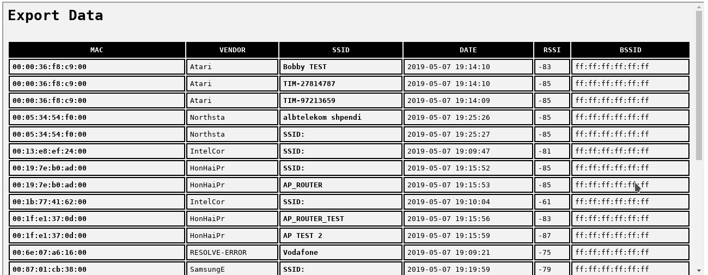
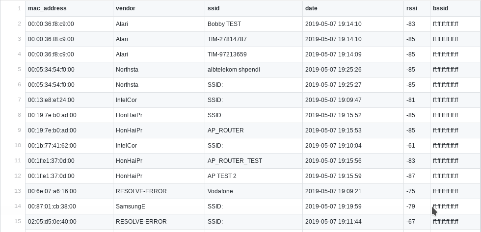

# exportProbe
*Export data from the tool **probeSniffer.py** (https://github.com/xdavidhu/probeSniffer)*

*Example export in **HTML**:*

*Example export in **CSV**:*

# Dipendenze

- sqlite3
- curl

# Donazioni

**BTC:** *3EwV4zt9r5o4aTHyqjcM6CfqSVirSEmN6y*

# Contatti

**Email:** *developer.vincenzog@gmail.com*
