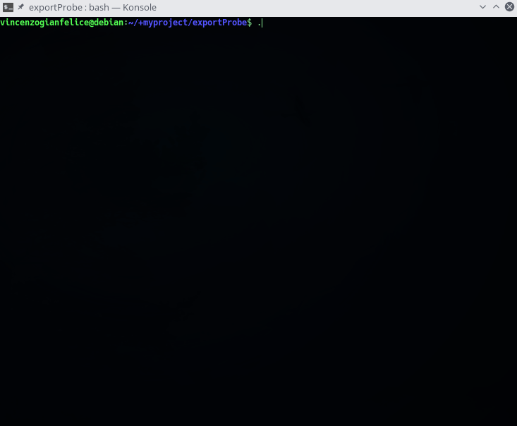

# exportProbe
*Export data from tool **probeSniffer.py** (https://github.com/xdavidhu/probeSniffer)*

<br />

*Now export in: **CSV**, **JSON**, **XML**, **HTML** and more!*

<p align="center">

</p>

*Example export in **HTML**:*

<p align="center">

</p>

*Example export in **CSV**:*

<p align="center">

</p>

# Dipendenze

- sqlite3
- curl
- awk

# Download And Upgrade

*Download*

```
git clone https://github.com/vincenzogianfelice/exportProbe
cd exportProbe
git submodule init
git submodule update
```

*Upgrade*

```
cd exportProbe
git pull
git submodule update --remote --merge
```
# Settings

Importa la tua API da macvendors.com. Effettua il login su https://app.macvendors.com/auth/login, genera il token
dalla pagina e inseriscila *exportProbe* nella variabile **API**:

```
#!/bin/bash

# Coded by: vincenzogianfelice <developer.vincenzog@gmail.com>
# View my github at https://github.com/vincenzogianfelice
# My site: https://vincenzogianfelice.altervista.org

set -o noclobber

########################
  API=''  # INSERT YOU API BEETWEN ' '. (eg.) API='saadljhniu2y78yinh21iuh21nyh2112....'
#######################\
```

# Donazioni

**BTC:** *3EwV4zt9r5o4aTHyqjcM6CfqSVirSEmN6y*

# Contatti

**Email:** *developer.vincenzog@gmail.com*
